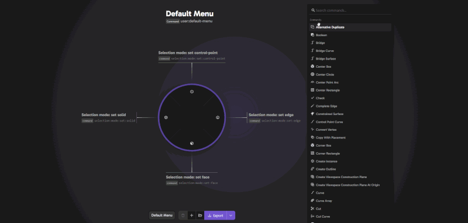
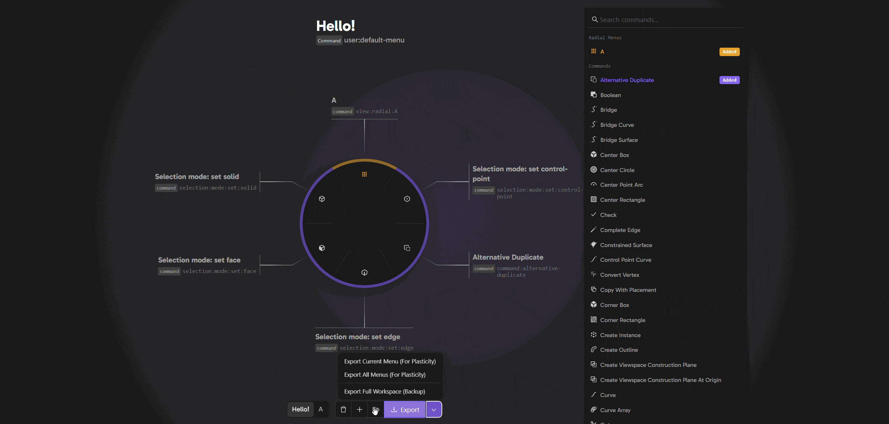
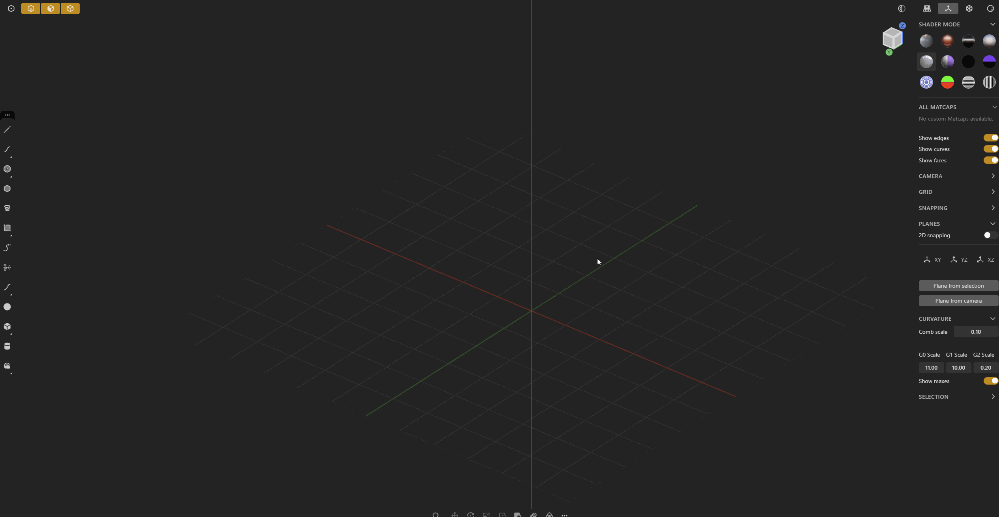

<h1 align="center">Plasticity Radial Menu Builder</h1>

<h3 align="center">
  Create, color-code, and manage multiple radial menus in one unified workspace.
</h3>

  

 

## 🛠 Plasticity Version Support
**Supports all versions up to v2026.1.3.**
*The command panel will be updated as new tools are released to ensure full compatibility.*

## Quick Start
1. **Open the Tool**: Click **[Live Tool](https://LostDox.github.io/plasticity_radial_menu_builder/)** to start building.
2. **Design**: Search for commands in the right-hand list and drag them onto the radial pie chart.
3. **Multi-Menu**: Click the `+` button to create separate, organized menus for Sketching, Modeling, etc.
4. **Export**: 
   - **Export Current**: Download the active menu as a `.radial.json` for use in Plasticity.
   - **Export Full Workspace**: Save your entire multi-tab setup and colors as a backup.
5. **Install**: Drag your exported `.radial.json` file directly into the Plasticity viewport. Press `F`, search for your menu name, and right-click to assign a shortcut.

---

## ✨ QOL Features
### 🌈 Dynamic Color Theming
Give every radial menu its own visual identity. Assign one of 14 curated colors; the entire interface—from the background glow to the pie slices—reacts to match your theme.

### 🗂️ Workspace Backups
Never lose your progress. Export your entire multi-menu workspace into a single JSON file. Importing it restores all your tabs, custom names, and color assignments instantly.

  

### 🧩 Multi-Radial Interface
Manage complex workflows with ease using a tabbed system. Switch between different menus instantly without losing your configuration.

### 🎨 Intuitive Iconography
Refined icon sets provide a clean, visual workflow that helps you identify tools at a glance.

### 🛠️ Seamless Integration
Designed specifically to mirror Plasticity's internal command structure for instant, error-free integration.

  

---

## 🏗️ Credits & Attribution
This project is an advanced fork of the [Plasticity Radial Menu Editor](https://github.com/PepperKUN/plasticity-radial-menu-editor) by **PepperKUN**.

**Upgrades by LostDox:**
- **Command Updates**: Fully updated with the latest Plasticity tool commands.
- **Reactive UI**: Full multi-radial support with color-coded workspaces for better navigation.
- **Persistence**: Added a robust Workspace Save/Load system.
- **UX Polish**: Streamlined the UI and removed redundant logic for a faster experience.

---

## ❓ FAQ

- **Do theme colors translate to Plasticity?**
  - No, colors are a QOL feature for this editor only to help you organize your menus visually.
- **Some icons don't perfectly match Plasticity's UI?**
  - Don't worry! Plasticity will display its own native icons once the menu is imported. The icons here are for visual guidance while building.
- **Why do my menus reset when I reload the page?**
  - This is a web tool. To save your work, use the **Export Full Workspace** button. You can then import that file later to pick up exactly where you left off.
- **Can I make my own version?**
  - Absolutely. Feel free to fork the project and customize it further.
- **Will you add more features?**
  - Feature requests are welcome! My primary focus is keeping the command list updated as Plasticity evolves.

---

## ⚖️ License
This project is licensed under the [Apache-2.0 license](LICENSE) - keeping it consistent with the original source.